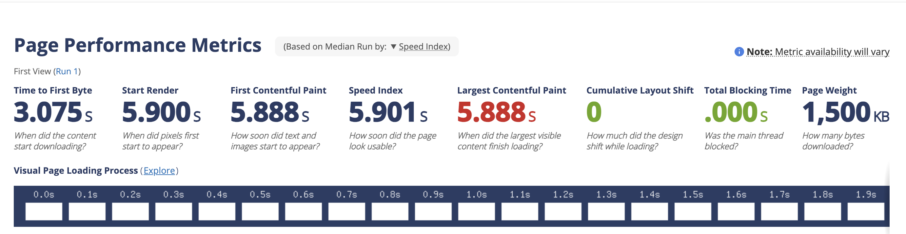

# 성능 최적화

## 주요 링크

- S3 버킷 웹사이트 엔드포인트: http://test-bucket-usea1.s3-website-us-east-1.amazonaws.com/
- CloudFrount 배포 도메인 이름: https://d1ocbelh1d8aw3.cloudfront.net

## 주요 개념

- GitHub Actions과 CI/CD 도구: GitHub Actions는 GitHub에서 제공하는 CI/CD 서비스로, 소프트웨어 개발 프로세스를 자동화하는 역할을 한다. 이를 통해 코드 변경 사항이 발생할 때 테스트, 빌드, 배포 등의 작업을 자동화할 수 있다.
- S3와 스토리지: AWS S3는 확장 가능한 객체 스토리지 서비스로, 정적 웹사이트 호스팅, 백업 및 데이터 저장소 등의 용도로 사용된다.
  - 객체(Object) 단위 저장: 파일과 메타데이터를 객체로 저장하며, 폴더 구조가 아닌 버킷(Bucket) 기반으로 관리된다.
  - S3는 정적 웹사이트 호스팅 기능을 제공하며, 다음과 같은 단계를 통해 배포할 수 있다.
    1.  S3 버킷 생성 (정적 웹사이트 호스팅을 활성화)
    2.  파일 업로드 (HTML, CSS, JavaScript 등의 정적 파일)
    3.  버킷 정책 설정 (퍼블릭 접근 허용 또는 CloudFront와 연계)
    4.  CloudFront와 연결하여 성능 최적화
- CloudFront와 CDN: CloudFront는 AWS에서 제공하는 글로벌 콘텐츠 전송 네트워크(CDN, Content Delivery Network)로, 사용자의 지리적 위치에 따라 최적의 엣지 로케이션(Edge Location)에서 콘텐츠를 제공한다.
  - CloudFront를 통한 배포 과정
    1. S3 버킷을 원본(origin)으로 설정
    2. CloudFront 배포(Distribution) 생성
    3. 도메인 연결 및 HTTPS 적용
    4. 캐싱 정책(Cache Policy) 설정
- 캐시 무효화(Cache Invalidation): CDN(예: CloudFront)은 성능 최적화를 위해 정적 콘텐츠를 캐싱한다. 하지만 파일이 업데이트되었을 때, 이전 캐시가 남아있으면 최신 콘텐츠가 반영되지 않는 문제가 발생할 수 있다. 이를 해결하기 위해 Cache Invalidation(캐시 무효화)가 필요하다.

  - CloudFront에서는 특정 파일을 무효화하여 새로운 콘텐츠를 즉시 반영할 수 있다.

    - AWS CLI를 이용한 캐시 무효화 명령어

    ```bash
    aws cloudfront create-invalidation --distribution-id <distribution-id> --paths "/*"
    ```

    - workflow 파일에 캐시 무효화 작업 추가

    ```yaml
    - name: Invalidate CloudFront cache
      run: |
        aws cloudfront create-invalidation --distribution-id ${{ secrets.CLOUDFRONT_DISTRIBUTION_ID }} --paths "/*"
    ```

- Repository secret과 환경변수: CI/CD 파이프라인을 구성할 때 보안이 필요한 정보(AWS 크리덴셜, API 키 등)을 직접 코드에 포함하는 것은 보안 취약점을 초래할 수 있다. 이를 방지하기 위해 GitHub은 Repository Secret을 제공한다.
  - 상세 예시는 상기 cache-invalidation workflow 파트 참조

## CI/CD 플로우


## 성능 최적화 비교

### 테이블 비교

- 상황 1 미국에 위치한 S3 버킷 웹사이트 엔드포인트와 클라우드 프론트 cdn을 사용한 성능 비교

- us에서 측정시
  - S3 버킷 웹사이트 엔드포인트: http://test-bucket-usea1.s3-website-us-east-1.amazonaws.com/
    
  - CloudFrount 배포 도메인: https://d1ocbelh1d8aw3.cloudfront.net
    

| 항목                  | s3-usea1 | cloudfront | 차이             |
| --------------------- | -------- | ---------- | ---------------- |
| TTFB                  | 3s       | 0.2s       | 2.8s(90% 감소)   |
| Last Contentful Paint | 5.8s     | 0.8s       | 5s(86% 감소)     |
| Page Weight           | 1500kb   | 389kb      | 1111kb(74% 감소) |

- 내 환경(한국) 에서 측정(light house)

  - s3
    
  - CloudFrount
    

| 항목                  | s3-usea1                                 | cloudfront                                 | 차이                  |
| --------------------- | ---------------------------------------- | ------------------------------------------ | --------------------- |
| 이미지 최적화         |  |  |                       |
| TTFB                  | 241ms                                    | 7.8ms                                      | 233ms(97% 감소)       |
| Last Contentful Paint | 1.4s                                     | 0.9s                                       | 0.5s(약 40% 감소)     |
| Page Weight           | 1.6mb                                    | 433kb                                      | 약1200kb(약 74% 감소) |

---

### 물리적 위치에 따른 성능 비교와 분석

- 상황2 미국사람이 한국s3/미국s3/cloudfront 접근시 성능 비교

  - S3 버킷 웹사이트 엔드포인트: http://test-bucket-apne2.s3-website.ap-northeast-2.amazonaws.com/
    

    | 항목                  | s3-apne2 | s3-usea1 | cloudfront |
    | --------------------- | -------- | -------- | ---------- |
    | TTFB                  | 3.2s     | 3.0s     | 0.2s       |
    | Last Contentful Paint | 6.6s     | 5.8s     | 0.8s       |
    | Page Weight           | 1500kb   | 1500kb   | 389kb      |

- 분석 내용
  - 분석을 해보면, 대략 cloudfront를 통한 압축과 cdn 환경을 사용하는 것이 성능이 압도적이다.
  - 가까운 지역의 s3를 접근하는 것이 지구 반대편에서의 결과보다 대략 10%정도 빠르다.(TTFB 0.2s 차이 | Last Contentful Paint 0.8s 차이)
  - s3는 어떤 위치에 존재하던지,같은 정적 파일을 전달 하기 떄문에 page weight는 동일하다.
